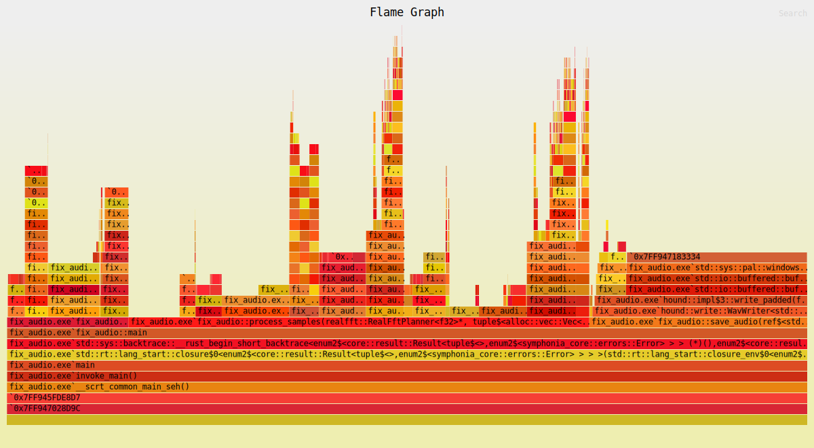

# Some set of DSP effects
Pet project of processing audio files by and for NekoAlosma to learn FFT processing

Currently, this program takes in stereo audio files (input folder created on first run) and:
* Aligns the phase angle between the left and right channel (Max of 90 degrees)
  * Concept based on Thimeo Stereo Tool's "Image phase amplifier: 0%", automated through Thimeo WatchCat
  * Use case: switching between a mono speaker to a car stereo
    * Prevents per-frequency phase cancellation for a better downmix to mono
    * Heavily reduces the perceived stereo width, but instrument placement / channel-specific sounds are preserved
* Averages the loudness of the left and right channel
  * Concept based on iZotope RX 11's "Azimuth" module, can't be automated
  * Use case: ensure that one channel doesn't overpower the other over the course of a track
    * Uses the EBU R 128 Integrated Loudness, while RX 11 uses plain RMS
    * Plain RMS is affected by DC bias and does not account for human hearing
* Add DC noise to reduce peak levels
  * Currently being used to test where and when DC noise is noticable. If so, this will be replaced with a DC removal step
  * Use case: Reduce peak levels while keeping the same loudness

Processed audio files are sent to the output folder as 32-bit floating-point .wav files. Non-audio files (covers, documents, etc.) are transfered to the output folder. The original audio files are kept in the input folder, so remember to delete them if you don't need to re-run the program with changes.

## Reflection
__Known problems I can't seem to fix__:
* Symphonia dev-0.6 doesn't support certain features
  * Try converting music files to .wav
    * .opus files or video files containing audio in general
    * .mp3 file output is longer than it should
* FFT alignment algorithm introduces clicks/distortion/zipper noise in certian audio
  * Main test song: SOPHIE - "JUST LIKE WE NEVER SAID GOODBYE"
    * Disconinuity at the start and end of some sections of audio
    * Bass between channels might just be highly uncorrelated?
  * Likely caused by short-time Fourier transform (STFT)
    * FFT itself is working correctly
    * Window is working correctly
    * Chunks/hopping seems to be working correctly
    * Click loudness mainly affected by FFT length and number of FFT overlaps
      * Partially affected by window choice, but that seems more like a spectral leakage problem
      * Click loudness also mitigated through improved alignment algorithm
    * Possible substitute: full-song FFTs
      * Issues: needs too many overlaps to reduce, but not eliminate, frequency smearing; needs a decent amount of memory
    * Possible substitute: complex wavelet instead of STFT
      * Issues: no known implementation of the inverse (discrete or continuous) complex wavelet transform in Rust
* FFT introduces relatively minor frequency smearing / pre-echo
  * Mainly affects very short hi-hats and sounds delayed in one channel

__Things to do__:
* Copy tags from input to output
  * Best library seems to be `lofty-rs`
* Add support for mono files
  * Force upmixing to stereo?
  * Make sure to bypass phase alignment
* Make code more idiomatic
  * Handle all existing `.unwrap()`s and `.expect()`s
* Increase program efficiency
  * The current memory usage is good, so the main feature to implement is multithreading
  * Main bottlenecks also seem to be Sympohonia decoding (I/O reading) and hound .wav file-saving (I/O writing)
    * Parallelism via `rayon` doesn't seem to improve times
  * Another improvement would be to set the program's priority class (Idle -> Above Normal) and I/O priority (Normal -> High)
    * Approximate 50% speedup (90s to 60s on an old test suite) using System Informer to apply priorities
* Add more error-checking
  * e.g. Vec memory allocation on 32-bit targets for long files (12-hours of audio)
    * could just suggest cutting down the audio into smaller bits

