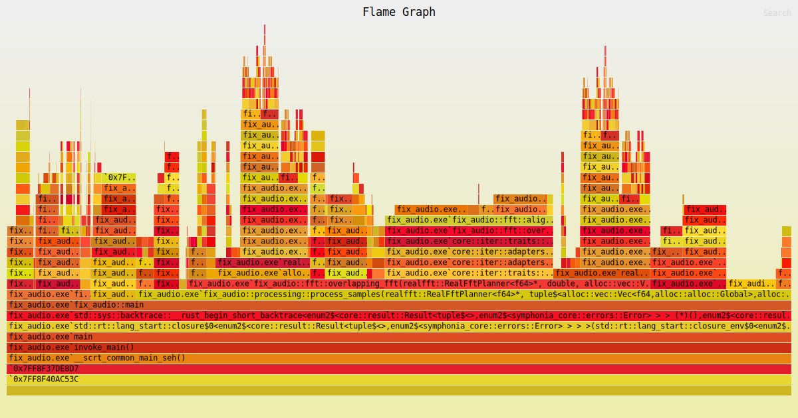

# Some set of DSP effects
Pet project of processing audio files by and for NekoAlosma to learn FFT processing

Currently, this program takes in stereo audio files (input folder created on first run) and:
* Aligns the phase angle between the left and right channel
  * Concept based on Thimeo Stereo Tool's "Image phase amplifier: 0%", automated through Thimeo WatchCat
    * Currently unable to replicate Stereo Tool's results, likely due to combination of window, overlapping, and alignment algorithm
  * Use case: switching between a mono speaker to a car stereo
    * Prevents per-frequency phase cancellation for a better downmix to mono
    * Heavily reduces the perceived stereo width, but instrument placement / channel-specific sounds are preserved
* Averages the loudness of the left and right channel
  * Concept based on iZotope RX 11's "Azimuth" module, can't be automated
  * Use case: ensure that one channel doesn't overpower the other over the course of a track
    * Uses the EBU R 128 Integrated Loudness, while RX 11 uses plain RMS
    * Plain RMS is affected by DC bias and does not account for human hearing
* Add DC noise to reduce peak levels
  * Currently being used to test where and when DC noise is noticable.
    * DC may be removed when encoding to a lossy codec
    * An actual DC removal step is used to improve the above two processes
    * If this step causes problems, it will be removed and this section will advertise the DC removal step
  * Use case: Reduce peak levels while keeping the same loudness

Processed audio files are sent to the output folder as 32-bit floating-point .wav files with tags and embedded covers transfered over. Non-audio files (covers, documents, etc.) are transfered to the output folder. The original audio files are kept in the input folder, so remember to delete them if you don't need to re-run the program with changes.

## Reflection
__Known problems I can't seem to fix__:
* Symphonia dev-0.6 doesn't support certain codecs and features
  * Try converting unsupported music files to 32-bit .wav
    * Video files with an audio track
    * .opus files
    * .mp3 files: does not support invalid CRC checksums, so output files will have added silence
* FFT alignment algorithm produces high peak levels in certain audio
  * Main test song: DJ Screw - "Backstreets (Screwed)"
    * Out-of-phase cough with reverb at 7:12
    * +9.25dB peak level even with added DC noise
* FFT produces relatively minor frequency smearing / pre-echo
  * Mainly affects very short hi-hats and sounds delayed in one channel

__Things to do__:
* Add option and confirmation to delete input files after processing
* Improve program efficiency
  * Approximate performance:
    * High variance due to I/O (disk and RAM), CPU performance should be consistent
    * 0.759 minutes of 44.1khz audio per real-life second
    * 0.698 minutes of 48khz audio per real-life second
    * 0.349 minutes of 96khz audio per real-life second
    * 0.174 minutes of 192khz audio per real-life second
  * Try a simpler FFT window with less cosine terms
  * Implement multithreading?
  * `mimalloc` being used as an alternative allocator. Minor 20MB overallocation and may give better performance on other platforms
  * (Windows only) Set the program's priority class (Idle -> Above Normal) and I/O priority (Normal -> High)
    * Approximate 50% speedup (90s to 60s on an old test suite) using System Informer to apply priorities
  * Add shortcut for mono files (add DC noise only)
* Add more error-checking
  * Handle all existing `.unwrap()`s and `.expect()`s
  * Vec memory allocation on 32-bit builds for long files of audio
    * Could just suggest cutting down the audio into smaller bits
  * Test files that shorter than FFT (sound effects?)
  * Mono files are converted to stereo files
* Make functions generic over floats (allow `f32` or `f64` in case more precision is needed)
  * Considering using `f64` over `f32` always to ensure no quantization noise/errors

